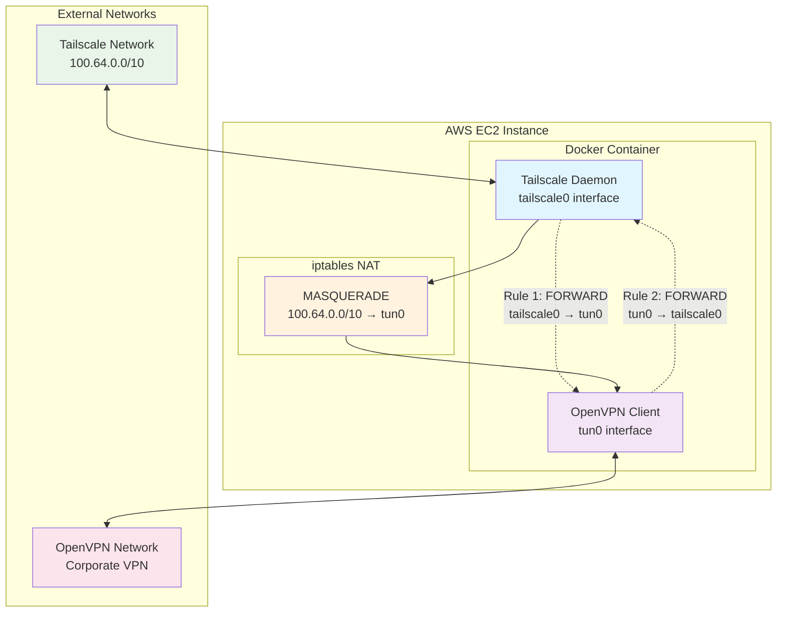

# Tailscale OpenVPN EC2 Bridge

A CDK for Terraform (CDKTF) project that deploys a VPN bridge infrastructure on AWS EC2, allowing Tailscale clients to seamlessly access corporate resources through OpenVPN tunnels.

## What It Is

This project creates a **VPN gateway** that bridges Tailscale's mesh networking with traditional OpenVPN connections. It deploys a containerized solution on AWS EC2 that acts as a gateway, enabling your Tailscale-connected devices to access corporate networks through OpenVPN without managing multiple VPN clients.

## What It Does

The infrastructure creates a **VPN bridge** that:

- **Connects Tailscale mesh network** to corporate OpenVPN networks
- **Routes traffic** between Tailscale clients and corporate resources
- **Provides centralized gateway** for corporate network access
- **Manages IP forwarding and NAT** using iptables rules
- **Runs containerized services** for Tailscale and OpenVPN on EC2

## Why Use This Solution

### For Remote Workers
- **Single VPN client**: Use only Tailscale on your devices while accessing corporate networks
- **Simplified management**: No need to manage multiple VPN clients or configurations
- **Seamless access**: Corporate resources appear as directly accessible through Tailscale

### For Organizations
- **Centralized control**: All corporate access flows through a monitored gateway
- **Multi-network support**: Access multiple corporate networks through different OpenVPN configs
- **Security**: Traffic is controlled, monitored, and logged through a single gateway
- **Scalability**: Easy to deploy multiple gateways for different regions or networks

### Technical Benefits
- **Device management**: Leverage Tailscale's superior device management and authentication
- **Network isolation**: Corporate networks remain isolated while providing controlled access
- **Monitoring**: All traffic can be monitored and logged for security compliance

## Architecture

The solution creates a VPN chain where Tailscale provides mesh networking and OpenVPN provides corporate access:



### How It Works

1. **Tailscale clients** send traffic to corporate resources (e.g., 10.1.1.100)
2. **Gateway receives** traffic via Tailscale interface (`tailscale0`)
3. **iptables rules** forward traffic from `tailscale0` to OpenVPN tunnel (`tun0`)
4. **NAT/MASQUERADE** changes source IP from Tailscale range to tunnel IP
5. **OpenVPN tunnel** sends traffic to corporate network
6. **Return traffic** follows the reverse path back to Tailscale clients

## Tech Stack

- **Infrastructure**: AWS EC2 (Amazon Linux 2023 ARM64)
- **Infrastructure as Code**: CDK for Terraform (CDKTF)
- **Development Environment**: Devbox (recommended) or manual setup with Python 3.8+, CDKTF, and dependencies
- **Language**: Python 3.8+
- **Containerization**: Docker & Docker Compose
- **VPN Technologies**: 
  - Tailscale (mesh networking)
  - OpenVPN (corporate access)
- **Networking**: iptables, IP forwarding, NAT
- **Cloud Provider**: AWS
- **Backend**: Terraform Cloud

## Prerequisites

### Common Requirements

- **AWS Account** with appropriate permissions
- **Tailscale Account** with auth keys
- **OpenVPN Configuration** files for corporate networks
- **Terraform Cloud** account for state management
- **AWS CLI** configured with credentials

### Development Environment Options

Choose **Option A** for simplified setup or **Option B** for manual control:

#### Option A: Using Devbox (Recommended)

- **Devbox** installed ([install devbox](https://www.jetify.com/devbox/docs/installing_devbox/))

*Devbox automatically provides: Python 3.8+, CDKTF, and all dependencies*

#### Option B: Manual Setup

- **Python 3.8+** installed
- **CDK for Terraform (CDKTF)** installed ([install guide](https://developer.hashicorp.com/terraform/tutorials/cdktf/cdktf-install))
- **pip** and **pipenv** or **poetry** for Python dependency management

**Why choose each option?**
- **Devbox**: Simplified setup, reproducible environment, automatic dependency management
- **Manual Setup**: Full control over versions, integration with existing development workflow

## Quick Start

### 1. Clone and Setup Development Environment

```bash
git clone https://github.com/sbasir/tailscale-openvpn-ec2-cdktf
cd tailscale-openvpn-ec2-cdktf
```

**Option A: Using Devbox**
```bash
# Enter devbox shell (provides Python, CDKTF, and dependencies)
devbox shell
```

**Option B: Manual Setup**
```bash
# Install Python dependencies
pipenv install && pipenv shell
```

**Ensure CDKTF is accessible**
```bash
cdktf --version
```

### 2. Configure Environment

Create a `.env` file (or set as Environment Variables) e.g:

```bash
# AWS Configuration
AWS_ACCESS_KEY_ID=your_aws_access_key
AWS_SECRET_ACCESS_KEY=your_aws_secret_key
AWS_SESSION_TOKEN=your_aws_session_token
AWS_REGION=me-central-1

# Terraform Cloud
TERRAFORM_ORGANIZATION=your_terraform_organization
TERRAFORM_WORKSPACE=tailscale-openvpn-me
SHORT_REGION=me

# Tailscale
TS_AUTH_KEY=your_tailscale_auth_key

# OpenVPN
OPENVPN_CONFIG_ENV=prod
```

### 3. Add OpenVPN Configuration

Place your OpenVPN configuration file e.g. for `prod`:

```bash
mkdir -p infra/config/environments/prod
# Copy your config.ovpn file to infra/config/environments/prod/config.ovpn
```

### 4. Deploy Infrastructure

```bash
cd infra
cdktf deploy
```

### 5. Configure Tailscale (Post-Deployment)

After deployment, you need to configure Tailscale to use the gateway:

#### Approve Routes and Exit Node

1. **Access Tailscale Admin**: Go to [https://login.tailscale.com/admin/machines](https://login.tailscale.com/admin/machines)

2. **Find Your Gateway**: Look for the machine with hostname pattern `{region}-aws-ovpn-{env}`

3. **Approve Subnet Routes**: 
   - Click on the gateway machine
   - Go to "Route settings" 
   - Approve the routes that the gateway is advertising (typically corporate network subnets)
   - See [Tailscale Subnet Routing Documentation](https://tailscale.com/kb/1019/subnets)

4. **Enable Exit Node** (if configured):
   - In the same machine settings, enable "Exit node" if you want to route all traffic through the gateway
   - See [Tailscale Exit Node Documentation](https://tailscale.com/kb/1103/exit-nodes)

5. **Wait for Registration**: Give the machines 2-5 minutes to register and sync settings

#### Using the Gateway

On your Tailscale clients:

```bash
# Use specific routes (recommended)
tailscale up --accept-routes

# Or use as exit node (routes all traffic)
tailscale up --exit-node={gateway-ip}
```

## Configuration

### Directory Structure

```
infra/
├── config/
│   ├── environments/         # Environment-specific OpenVPN configs
│   │   ├── prod/
│   │   │   └── config.ovpn   # Production OpenVPN config
│   │   └── non-prod/
│   │       └── config.ovpn   # Non Production OpenVPN config
│   └── templates/            # Configuration templates
├── docker/                   # Docker configurations
│   ├── compose/              # Docker Compose files
│   ├── Dockerfiles/          # Custom Dockerfiles
│   └── scripts/              # Entrypoint scripts
└── src/                      # CDKTF source code
    ├── main.py               # Main application
    └── stacks/               # Stack definitions
```

### Environment Variables

| Variable | Description | Required |
|----------|-------------|----------|
| `AWS_ACCESS_KEY_ID` | AWS access key | ✓ |
| `AWS_SECRET_ACCESS_KEY` | AWS secret key | ✓ |
| `AWS_SESSION_TOKEN` | AWS session token | ✓ |
| `AWS_REGION` | AWS region | ✓ |
| `TERRAFORM_ORGANIZATION` | Terraform Cloud org | ✓ |
| `TERRAFORM_WORKSPACE` | Terraform workspace | ✓ |
| `SHORT_REGION` | Short region identifier | ✓ |
| `TS_AUTH_KEY` | Tailscale auth key | ✓ |
| `OPENVPN_CONFIG_ENV` | OpenVPN config environment | ✓ |

## Management Commands

All commands should be run from the `infra/` directory with your development environment active:

- **Devbox users**: Run `devbox shell` first
- **Manual setup users**: Activate your virtual environment (e.g., `pipenv shell`)

```bash
# Deploy infrastructure
cdktf deploy

# View deployment plan
cdktf plan

# Destroy infrastructure
cdktf destroy

# View current state
cdktf list

# Check differences
cdktf diff
```

## Networking Details

For detailed information about the network architecture, iptables rules, and packet flow, see the [Network Documentation](infra/docs/NETWORK.md).

## Security Considerations

- **Firewall Rules**: Only necessary ports are opened
- **NAT**: Tailscale IPs are hidden from corporate network
- **Container Isolation**: Services run in separate containers
- **Traffic Monitoring**: All traffic can be monitored and logged
- **Access Control**: Tailscale provides device authentication and authorization

## Troubleshooting

### Common Issues

1. **Deployment Fails**: Check environment variables, AWS credentials, and that your development environment is properly set up
2. **CDKTF Command Not Found**: 
   - **Devbox users**: Ensure you're in the devbox shell (`devbox shell`)
   - **Manual setup users**: Verify CDKTF is installed and in PATH, activate virtual environment
3. **Python Import Errors**: 
   - **Devbox users**: Exit and re-enter devbox shell
   - **Manual setup users**: Ensure virtual environment is activated and dependencies are installed
4. **Tailscale Not Connecting**: Verify auth key and network connectivity
5. **OpenVPN Issues**: Check OpenVPN configuration file format
6. **Traffic Not Routing**: Verify routes are approved in Tailscale admin

### Debugging Commands

```bash
# Check container logs
docker-compose logs tailscale
docker-compose logs openvpn

# Check iptables rules
iptables -L FORWARD -v
iptables -t nat -L POSTROUTING -v

# Monitor traffic
tcpdump -i tailscale0
tcpdump -i tun0
```

## Contributing

1. Fork the repository
2. Create a feature branch
3. Make your changes
4. Add tests for new functionality
5. Update documentation
6. Submit a pull request

## License

This project is licensed under the MIT License - see the [LICENSE.md](LICENSE.md) file for details.

## Support

For issues and questions:
- Check the [Network Documentation](infra/docs/NETWORK.md) for detailed technical information
- Review [Tailscale Documentation](https://tailscale.com/kb/) for Tailscale-specific issues
- Open an issue in this repository for project-specific problems

## Related Documentation

- [Tailscale Subnet Routing](https://tailscale.com/kb/1019/subnets) - How to configure subnet routing
- [Tailscale Exit Nodes](https://tailscale.com/kb/1103/exit-nodes) - How to configure and use exit nodes
- [Tailscale Admin Console](https://login.tailscale.com/admin/machines) - Machine management interface
- [Network Architecture Guide](infra/docs/NETWORK.md) - Detailed network topology and iptables rules 