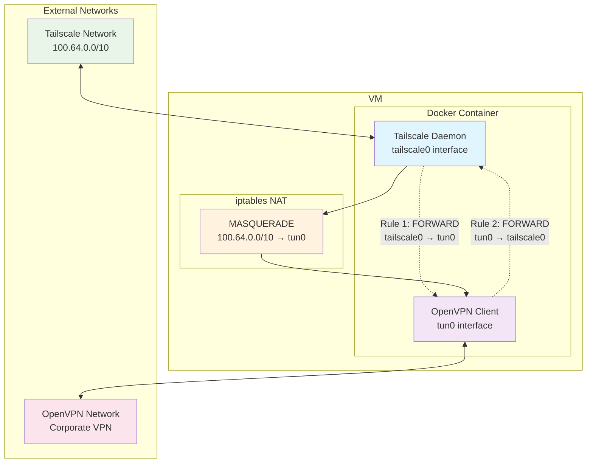
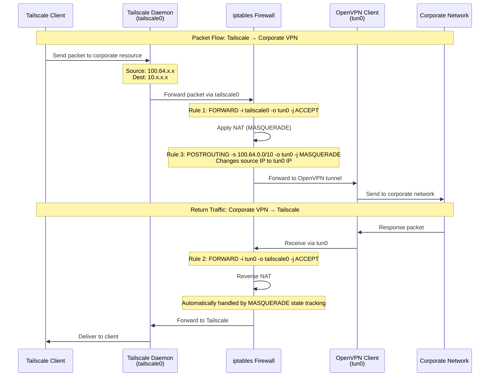

# Network Architecture & iptables Rules

This document explains the network architecture and iptables rules used in the Tailscale + OpenVPN infrastructure.

## Overview

The infrastructure creates a **VPN bridge** that allows Tailscale clients to access corporate resources through an OpenVPN connection. This is achieved using iptables rules that forward traffic between the Tailscale interface (`tailscale0`) and the OpenVPN tunnel interface (`tun0`).

## Network Topology



## iptables Rules Breakdown

The following iptables rules are configured in `docker/scripts/tailscale-entrypoint.sh`:

### Rule 1: Tailscale → OpenVPN Forwarding
```bash
iptables -A FORWARD -i tailscale0 -o tun0 -j ACCEPT
```
- **Purpose**: Allow packets from Tailscale interface to OpenVPN tunnel
- **Direction**: `tailscale0` → `tun0`
- **Effect**: Tailscale clients can send traffic through the OpenVPN tunnel

### Rule 2: OpenVPN → Tailscale Forwarding
```bash
iptables -A FORWARD -i tun0 -o tailscale0 -j ACCEPT
```
- **Purpose**: Allow return traffic from OpenVPN tunnel back to Tailscale
- **Direction**: `tun0` → `tailscale0`
- **Effect**: Responses from corporate network can reach Tailscale clients

### Rule 3: NAT/MASQUERADE
```bash
iptables -t nat -A POSTROUTING -s 100.64.0.0/10 -o tun0 -j MASQUERADE
```
- **Purpose**: Hide Tailscale IP addresses from the corporate network
- **Effect**: Changes source IP from Tailscale range (100.64.x.x) to the OpenVPN tunnel IP
- **Why needed**: Corporate networks might not route back to Tailscale IPs

### Rules 4 & 5: General OpenVPN Forwarding
```bash
iptables -A FORWARD -i tun0 -j ACCEPT
iptables -A FORWARD -o tun0 -j ACCEPT
```
- **Purpose**: Allow all traffic in/out of OpenVPN tunnel
- **Effect**: Ensures OpenVPN can communicate freely

## Packet Flow Sequence



## Network Flow Example

Let's trace a packet from a Tailscale client accessing a corporate server:

1. **Tailscale Client** (100.64.1.5) wants to access **Corporate Server** (10.1.1.100)
2. Packet arrives at container via **tailscale0** interface
3. **Rule 1** allows forwarding from tailscale0 → tun0
4. **Rule 3** (MASQUERADE) changes source IP from 100.64.1.5 to OpenVPN tunnel IP (e.g., 172.30.249.2)
5. Packet exits via **tun0** to corporate network
6. Corporate server responds to 172.30.249.2
7. **Rule 2** allows return traffic tun0 → tailscale0
8. **MASQUERADE** automatically reverses NAT back to 100.64.1.5
9. Response reaches Tailscale client

## IP Address Ranges

| Network | IP Range | Purpose |
|---------|----------|---------|
| Tailscale | 100.64.0.0/10 | Tailscale mesh network |
| OpenVPN | 172.30.x.x/27 | OpenVPN tunnel IP |
| Corporate | 10.x.x.x/16 | Corporate network resources |

## Why This Setup is Useful

This configuration creates a **VPN chain** where:
- **Tailscale** provides easy mesh networking and device management
- **OpenVPN** provides access to corporate resources
- **The bridge** allows Tailscale clients to seamlessly access corporate networks through the OpenVPN tunnel

## Use Cases

This configuration is particularly useful for:

- **Remote Workers**: Who need corporate VPN access without managing multiple VPN clients
- **Multi-Network Access**: Accessing multiple corporate networks through different OpenVPN configs
- **Centralized Gateway**: Centralizing VPN access through a single Tailscale-connected gateway
- **Simplified Management**: Using Tailscale for device management while maintaining corporate VPN access
- **Security**: All corporate access flows through a controlled, monitored gateway

## Troubleshooting

### Common Network Issues

1. **Traffic not forwarding**: Check if IP forwarding is enabled
   ```bash
   sysctl net.ipv4.ip_forward
   ```

2. **NAT not working**: Verify MASQUERADE rule is active
   ```bash
   iptables -t nat -L POSTROUTING -v
   ```

3. **Interface not available**: Check if interfaces are up
   ```bash
   ip link show tailscale0
   ip link show tun0
   ```

### Debugging Commands

```bash
# Check iptables rules
iptables -L FORWARD -v
iptables -t nat -L POSTROUTING -v

# Monitor traffic
tcpdump -i tailscale0
tcpdump -i tun0

# Check routing table
ip route show
```

## Security Considerations

- **Firewall Rules**: Only necessary ports are opened
- **NAT**: Tailscale IPs are hidden from corporate network
- **Isolation**: Each service runs in separate containers
- **Monitoring**: Traffic can be monitored and logged

## Performance Considerations

- **Latency**: Double-hop through Tailscale and OpenVPN adds latency
- **Bandwidth**: Limited by the slower of the two VPN connections
- **CPU**: NAT processing requires CPU resources on the gateway

## Configuration Files

- **iptables rules**: `docker/scripts/tailscale-entrypoint.sh`
- **Docker networking**: `docker/compose/ts-ovpn.docker-compose.yml`
- **Tailscale config**: `config/templates/docker.ts.ovpn.env.template` 